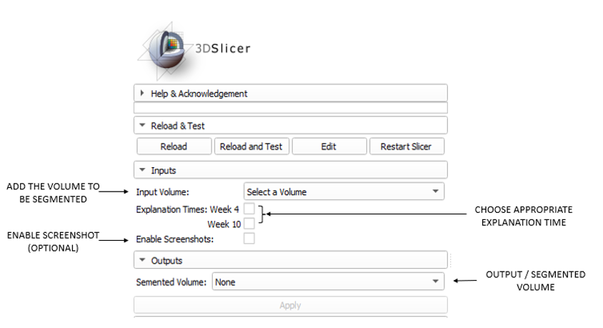
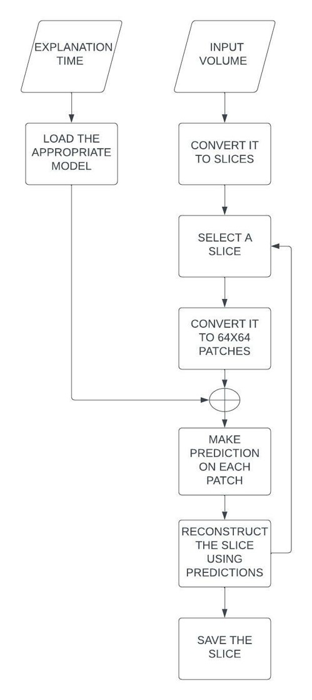
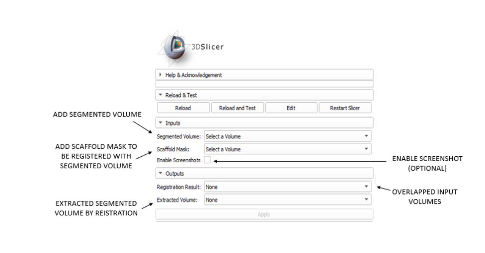
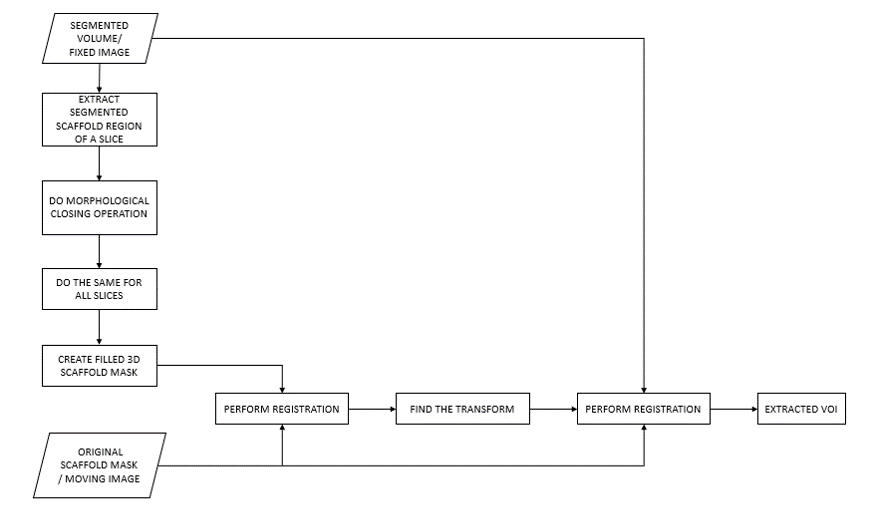
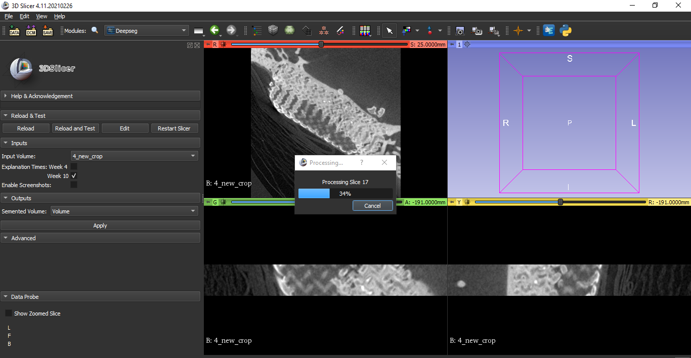
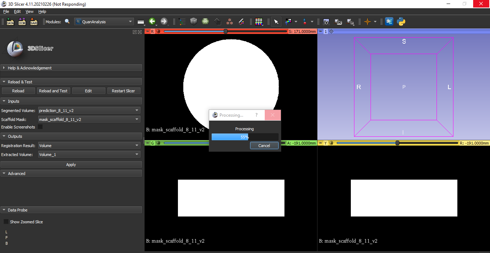
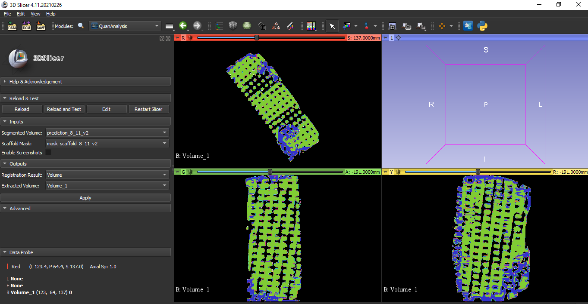
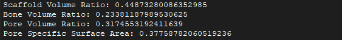
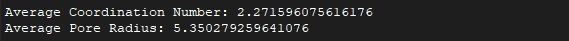

# DeepScaffoldAnalysis extension for 3D Slicer

DeepScaffoldAnalysis extension for [3D Slicer](https://www.slicer.org) contains DeepSeg and QuanAnalysis modules for the segmentation and quantitative analysis of scaffold degradation and bone ingrowth in biometrial structural scaffold.

## Introduction 

Biodegradable scaffolds developed using biomaterials such as bioactive glass are a potential solution for bone fracture. Biodegradable structural scaffolds' three-dimensional (3D) structure and architecture are important in the formation of bone inside the structural scaffolds because they affect the functionality of tissue-engineered constructs. Assessment techniques for scaffold structure and their efficacy in bone ingrowth studies require an ability to accurately quantify the 3D structure of the scaffold and an ability to investigate the bone regenerative processes within the scaffold structure. A novel 3-stage pipeline is implemented for accurate and reproducible 3D µ-CT imaging-based analysis study of bone ingrowth into 3D printed biodegradable structural scaffolds. The first stage of the pipeline is based on a convolutional neural network (CNN) for the segmentation of the scaffold, bone, and pores from µ-CT images to investigate bone ingrowth. A 3D rigid image registration procedure was employed in the next stage to extract the volume of interest (VOI) for the analysis. In the final stage, algorithms were developed to quantitatively analyze bone ingrowth and scaffold degradation. 

## Modules overview 

Currently, the modules of extension contains the following features.

### Module 1 - DeepSeg 

- GUI

    * Purpose  
        * Automatically segment µ-CT images of 3D printed scaffold into scaffold, bone and pore

    * Input 
        * Micro-CT volume
        * Explanation time
        * Enable screenshot  

    * Output 
        * Segmented Volume 

- Logic 

### Module 2 - QuanAnalysis

- GUI

    * Purpose  
        * Quantitively analyse bone ingrowth and scaffold degradation on VOI 

    * Input 
        * Segmented Micro-CT volume
        * Scaffold mask created using radius and height parameters (Cylindrical mask)
        * Enable screenshot  

    * Output 
        * 3D rigid image registration results
        * Extracted VOI by registration

- Logic 

## Installation and setup

### Installing DeepScaffoldAnalysis

1. Download Slicer Stable Release from here: https://download.slicer.org/ It's version is 4.11.20210226
2. Install Slicer
3. Open Slicer
4. Go to module in application settings and add path of Deepseg and QuanAnalysis modules 
5. Restart Slicer
6. On the upper-left search box write type "Deepseg" 
7. Click the "Switch to module"

### Demo

Code for these demos is in this repository.

- DeepSeg module demo

- QuanAnalysis module demo

### Results 

- DeepSeg module results

- QuanAnalysis module results

## Acknowledgement

This research was partially funded by the National Institute for Health Global Health Research (grant number 1613745: NIHR Group on POsT Conflct Trauma ; PrOTeCT).